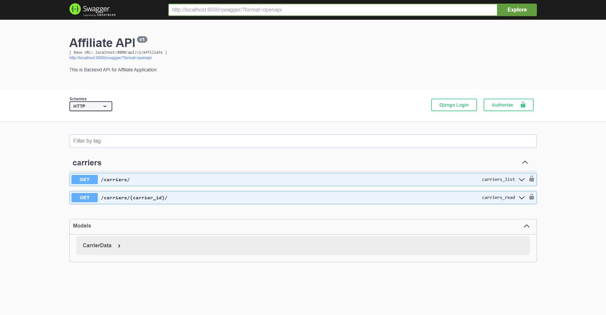

# Affiliate Test-Task Django Rest

## Overview

---------------------------------
[1. Starting up](#starting-up)
- [Copy local templates](#firstly-copy-local-templates-using-makefile)
- [Configure .envs](#configure-envs)
- [Run Docker Containers](#run-docker-containers)

[2. API Documentation](#available-api-documentation)
- [Swagger-Docs](#swagger-at-httplocalhostswagger)
- [API Endpoints](#existing-endpoints)
---------------------------------

## Starting up

### Firstly, copy local templates using Makefile

- Create folder named `local` at the root of the project

```shell
make copy-template
```

### Configure .envs

Add env file for prod (docker) >>> **.env.prod**

And env file for local development >>> **.env.local**

(Both at the root of the project)

Required settings >>> .env.prod

```.env
# .env.prod

# Django settings
CORESETTINGS_IN_DOCKER=true
SECRET_KEY='django-insecure-=okvqjswarmd2ymc#jxqo-t7a(9qpvk-dk8v#9$t^c(dlbmw)b'

DOMAIN=localhost

# PostgreSQL & pgAdmin
POSTGRES_DB=affiliate
POSTGRES_USER=postgres
POSTGRES_PASSWORD=strong_password

PGADMIN_DEFAULT_EMAIL=email@dev.affiliate
PGADMIN_DEFAULT_PASSWORD=strong_password

# Parse
PARSE_ACCESS_TOKEN=YOUR_API_TOKEN
```

(Optional)
Required settings >>> .env.local

```.env
# .env.local

# Django settings
CORESETTINGS_IN_DOCKER=true
SECRET_KEY='django-insecure-=okvqjswarmd2ymc#jxqo-t7a(9qpvk-dk8v#9$t^c(dlbmw)b'

# PostgreSQL & pgAdmin
POSTGRES_DB=affiliate
POSTGRES_USER=postgres
POSTGRES_PASSWORD=strong_password

# Parse
PARSE_ACCESS_TOKEN=YOUR_API_TOKEN
```

### Run Docker Containers

(First build)

```shell
make build-prod-container
```

(Relaunch existing containers)

```shell
make prod-container-up
```
---------------------------------
## Available API documentation

### Swagger at http://localhost/swagger



### Existing endpoints

- `/api/v1/affiliate/carriers` (GET)
- Query params
`min_ecpc`, `carrier_name`, `country_name`, `limit`, `offset`, `order_by={field_name}`, `order_type=[asc, desc]`


- `/api/v1/affiliate/carriers/{carrier_id}` (GET)
- Arguments `{carrier_id}`
